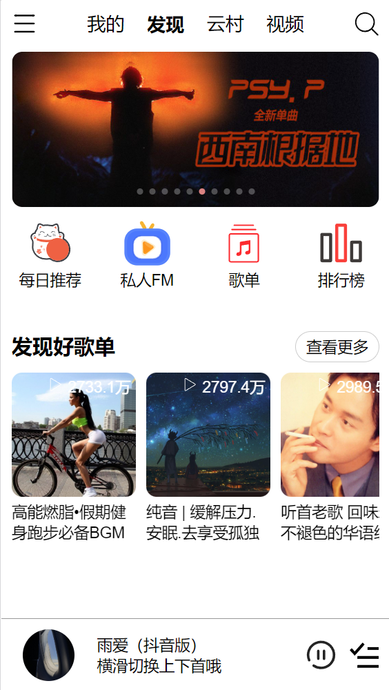
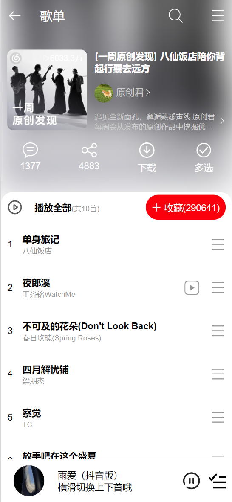

# MyNetease Project
[](https://github.com/Lxinyu1999/Ashiton.github.io)


This is a front-end project for a third-party Netease player specifically designed for mobile interfaces.

## Implementation
- ✅ Full Bucket Development with Vue.js
- 🔨 Writing backend server code using node.js
- 🧰 Vant for component library
- 🌐 Axios to fetch server-side data
- 🔴 Support for registration, account login
- 📻 Support private FM / daily recommended songs
- 🚫🤝 No any social function
- 🛠 More features under development


## Environment

The backend is provided by [NeteaseCloudMusicApi](https://github.com/Binaryify/NeteaseCloudMusicApi) API.

Configuration

```shell
# Install dependencies
git clone git@github.com:Binaryify/NeteaseCloudMusicApi.git
cd NeteaseCloudMusicApi
npm install

#Port setting (default port is 3000)
PORT=4000 node app.js

#Run (web version)
node app.js
```

```shell
#Renew version
npx NeteaseCloudMusicApi@latest
```

## Display

### 🏠Homepage  


### 🎶List



### 📟Play song


## 🙏Acknowledgement
Thanks to
- [Apple Music](https://music.apple.com)
- [YouTube Music](https://music.youtube.com)
- [Spotify](https://www.spotify.com)
- [网易云音乐](https://music.163.com)
